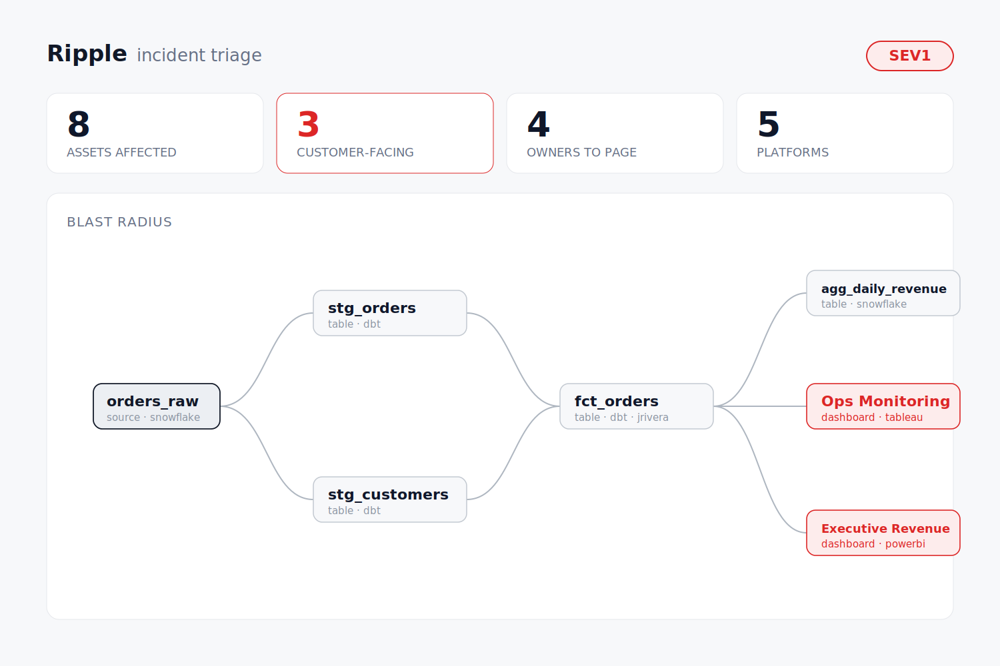

# ripple

A data-incident triage agent for DataHub. Point it at a table that just broke and it walks the downstream lineage across every platform, ranks what's on fire by who gets paged first, and writes the incident back into the catalog — an `incident` tag, a runbook, and a native Incident entity — in a single command. ~1,600 lines of Python, no lineage crawling done by hand.

A break in one table ripples through everything built on top of it; ripple follows the wave to the edge and tells you exactly what it hit.

<p align="center">
  
</p>

## Features

**Blast radius** — one URN in, the whole downstream set out: every affected table, view, and dashboard across all lineage hops, ranked by criticality with an auto-assigned severity — SEV1 the moment a customer-facing dashboard lands in the blast zone.

**Root cause** — flip the traversal upstream to rank the likely *sources* of bad data, closest raw table first, so you start looking where data actually enters instead of where it surfaced.

**Column-level** — not "this dashboard is affected" but the exact column that traces back to the broken field, read from fine-grained lineage.

**Knows who to page** — resolves owners across the blast radius and surfaces the ones sitting on customer-facing surfaces first, so the on-call page goes to the right people.

**Writes the incident back** — this is the point. Ripple doesn't just report; it acts on the catalog:

| Write-back | Aspect |
|---|---|
| `incident` tag on the broken asset | GlobalTags |
| triage runbook in the documentation panel | EditableDatasetProperties |
| a first-class incident on the asset | IncidentInfo |

**Auto-trigger** — a `watch` loop polls for broken assets and triages them on its own; swap the detector for DataHub assertion-failure events and it's fully hands-off.

**Two front-ends** — a rich terminal UI (severity banner, lineage tree, ranked table, recommended actions) and a read-only web dashboard with an interactive lineage graph and light/dark themes. The graph is hand-rolled SVG — no charting library, no CDN.

## Quickstart

```sh
# needs a running DataHub (a local `datahub docker quickstart` is enough) and Python 3.10+
uv pip install -e .

# point ripple at your instance
cp .env.example .env          # set DATAHUB_GMS_TOKEN — grab it from ~/.datahubenv

# seed a realistic incident scenario, then triage the source it prints
python demo/seed_incident_demo.py
python -m ripple triage "urn:li:dataset:(urn:li:dataPlatform:snowflake,prod.raw.orders_raw,PROD)"
```

> No DataHub handy? Try the [live simulator](https://chakri192.github.io/ripple/) — click any table to break it and watch the triage run entirely in the browser.

The commands:

| Command | What it does |
|---|---|
| `ripple triage <urn>` | Downstream blast radius, ranked, with write-back |
| `ripple triage <urn> --no-write-back` | Report only — touches nothing |
| `ripple triage <urn> --columns --incident` | Add column-level impact and raise an Incident entity |
| `ripple root-cause <urn>` | Trace upstream, rank the likely sources |
| `ripple watch --interval 15` | Poll for broken assets and auto-triage them |
| `ripple web` | Serve the dashboard on `:8000` |

## How it works

```
  broken URN
      │
      ▼
  ┌── read ────────────────┐   searchAcrossLineage (MCP / SDK)
  │  downstream lineage,   │──▶ DataHub GMS
  │  owners, columns       │
  ├── reason ──────────────┤
  │  rank by criticality,  │──▶ severity (SEV1–3)
  │  draft the narrative   │──▶ LLM   (facts stay deterministic)
  ├── write ───────────────┤
  │  tag · runbook ·       │──▶ DataHub GMS
  │  Incident entity       │
  └────────────────────────┘
```

The split is deliberate: **lineage traversal, owner resolution, and ranking are plain code** — same input, same output, every run. An LLM only writes the human-readable report. Nothing about *what* is affected is ever generated by a model, which is what makes the analysis safe to act on and the demo reproducible.

## Layout

```
ripple/
  ripple/      the agent — client · triage · report · watch · ui · web
  demo/        seeds a source → 5 tables → 3 dashboards incident scenario
  docs/        the landing page + in-browser simulator
  examples/    sample generated incident reports
```

## License

Apache-2.0 — see [LICENSE](LICENSE).
